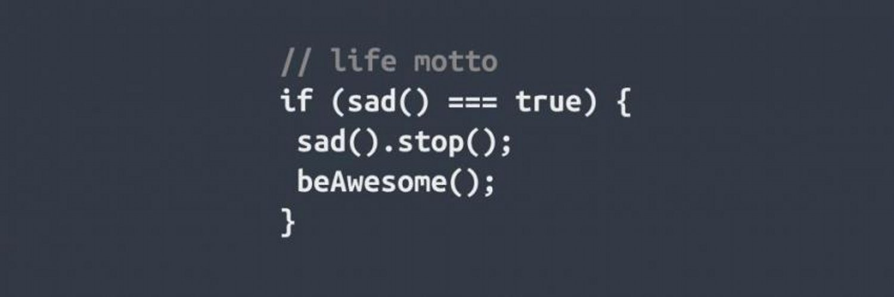

I'm sure you've seen some bad code on the internet like this:

What the heck? If sad() returns true how do you call .stop() on it???

Well, this repo is about making this kind of codes possible (or die trying). Let's get coding!
